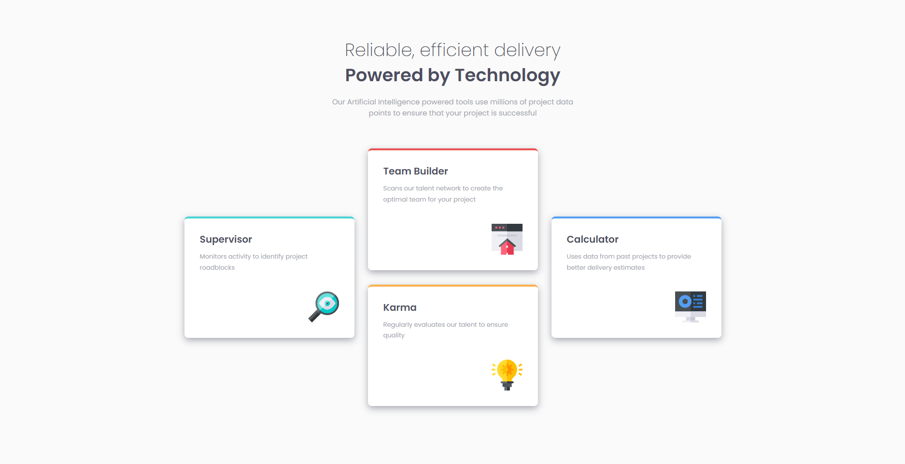
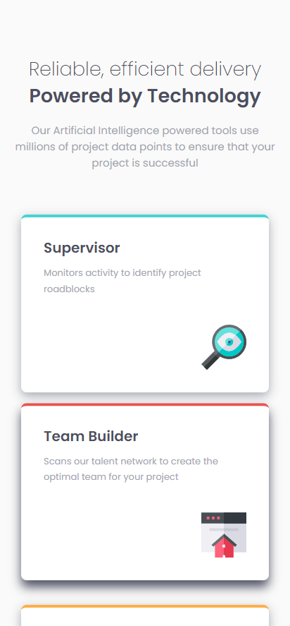

# Frontend Mentor - Four card feature section

This is a solution to the [Four card feature section challenge on Frontend Mentor](https://www.frontendmentor.io/challenges/four-card-feature-section-weK1eFYK). Frontend Mentor challenges help you improve your coding skills by building realistic projects.

[Solution][solution-url] . [Live Page][live-page]

Table of contents

-   [Overview](#overview)
    -   [The challenge](#the-challenge)
    -   [Screenshots](#screenshots)
    -   [Links](#links)
-   [My process](#my-process)
    -   [Built with](#built-with)
    -   [Useful resources](#useful-resources)
-   [Author](#author)

## Overview

### The challenge

Users should be able to:

-   View the optimal layout depending on their device's screen size
-   See hover and focus states for interactive elements

### Screenshots

<table>
        <tr>
            <td>
                
            </td>
            <td>
                
            </td>
        </tr>
</table>

### Links

-   [Solution][solution-url]
-   [Live Page][live-page]

## My process

### Built with

-   Semantic HTML5 markup
-   CSS custom properties
-   Flexbox
-   Grid

(<a href="#top">back to top</a>)

### Useful resources

-   [Flexbox](https://css-tricks.com/snippets/css/a-guide-to-flexbox/)
-   [Flex](https://www.w3schools.com/css/css3_flexbox.asp)
-   [Box-shadow](https://stackoverflow.com/questions/32571296/how-to-prevent-adjoining-elements-from-moving-when-increasing-border-width)
-   [Grid center](https://www.geeksforgeeks.org/how-to-center-a-div-using-css-grid-property/)
-   [Grid](https://www.w3schools.com/css/css_grid.asp)

(<a href="#top">back to top</a>)

## Author

-   Frontend Mentor - [link](https://www.frontendmentor.io/profile/JCzyszczon)

(<a href="#top">back to top</a>)

[live-page]: https://four-card-feature-section-eight-mu.vercel.app
[solution-url]: https://www.frontendmentor.io/solutions/responsive-four-card-feature-section-eh_qkdNS7D
